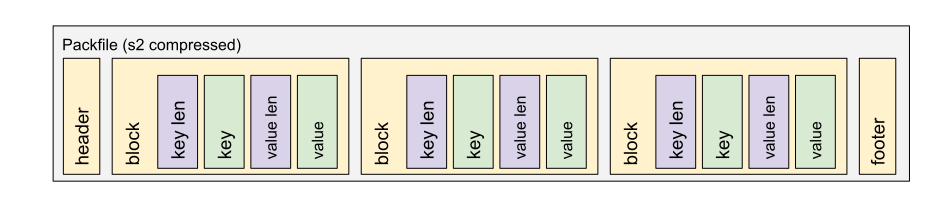

# Super-Blockstore

Super-Blockstore is a new go IPFS storage inspired by how Git works. It uses all the research, ideas, and development being done to make Git faster over the years.

Blocks are stored in insert order instead of key order and concatenated in bigger files called packs. Packs are the source of truth, but other indexes can be created to improve lookup performance:

- IDX file: hashed keys are stored in lexicographic order with data as the offset where the value is stored in the pack file, crc32, and the size of the value.

## Why?

Actual Data stores implementation are using different databases that are not designed to store blob blocks, causing problems when the amount of blocks is big enough. With this approach, we want to use well-known technologies specifically designed to store this kind of data, and still be performant on retrieval and storage. Also, the modular nature of the possible indexes makes this approach easy to evolve and adapt for several use cases.

## Design

### Packfile

Packfiles contain the source of truth. All other indexes can be created by reading the packfile.

The header contains a 3 bytes signature (SPB) and a uint32 version number, currently 0.

The footer contains the SHA256 checksum with all of the above.

### IDX file

IDX files are indexes with offsets pointing keys into a position in the packfile, with some extra info like crc32 and value size.

The header contains a 3 bytes signature (SPI) and a uint32 version number, currently 0.

Fanout table: always containing 255 entries with 4-byte integers. The N-th entry of this table records the number of objects in the corresponding pack, the first byte of whose object name is less than or equal to N. The 255-th value of this table is giving you the total number of elements on the packfile.

A table of shorted sha256 block keys.

A table of 4 bytes value sizes of the packed data.

A table of 4 bytes offset values. Large offsets are encoded as an index into the next table with the msbit set.

A table of 8-byte offset entries (empty for pack files less than 2 GiB). 

Footer with the pack sha256 checksum of the corresponding packfile, and an index sha256 checksum with all of the above.

## How it works

All packfiles are read-only after they are created, there are no file modifications. When data is deleted, we add them to a tombstone until the next call into GC.

### Single Put

A packfile and an index are being generated on a processing folder, adding all values from all the Put operations. These values won't be available until `Sync` is called. When `Sync` is called, the new packfile and IDX files are closed and written to disk. Then they are moved into the final folder with all other packfiles and added into available packfiles that can be queried.

### Single Get

A get operation goes through all IDX files inside the final storage folder looking for the specified key.

### Batch Put

A new packfile is created on every batch in the processing folder. If the batch is discarded, the file is deleted. If the batch is committed, the pack and IDX files are moved into the final folder and after that are available for the following queries.

### Deletions

All deleted keys are stored in a tombstone. The key is also removed from the LRU cache if present. This file is queried on every Get operation to check if the requested key is deleted or not.

### GC

When a GC is triggered, packfiles are regenerated depending on the specified properties in the configuration, like the number of objects per packfile.

- Get the actual packfiles that are in the data folder. This is done to avoid processing new packfiles that are being generated at the same time we are executing the GC process.
- Repack previous packfiles checking for any deleted key and adjusting the packfile object count using configuration. Generate new indexes at the same time.
- If the packfile that is being processed contains no deleted keys, and the amount of values is the expected one, leave it as it is.
- If not, read the next packfile until a new packfile with the requested size is created.
- Copy the new packfile into the final folder. Mark fully processed packfiles as ready to be deleted.
- Continue with this operation until all packfiles are checked for deleted keys and all of them contain the specified number of values.
- Truncate the tombstone file.
- When a heavy GC is triggered, we check for duplicated values on packfiles and we remove them (WIP).

This process does not block normal data store usage. New data can be added and deleted when executing the GC.

## Future work

The actual implementation, even being the simplest one, can surpass read speed compared with other common data stores. The possibility of adding any kind of index improving even more specific use cases adds a lot of possibilities and even more room for better performance. These are some of the ideas that can be implemented:

- MIDX: IDX files containing the index of several packfiles in one. [link](https://git-scm.com/docs/pack-format#_multi_pack_index_midx_files_have_the_following_format).
- Improve the tombstone format. Now everything is on memory, not mmapped to disk.
- Add block metrics to identify blocks that are usually requested at the same time, to put them together into the packfile improving fetch speed.
- Use of bitmaps: [link](https://git-scm.com/docs/bitmap-format).
- Graph format: [link](https://git-scm.com/docs/commit-graph-format).